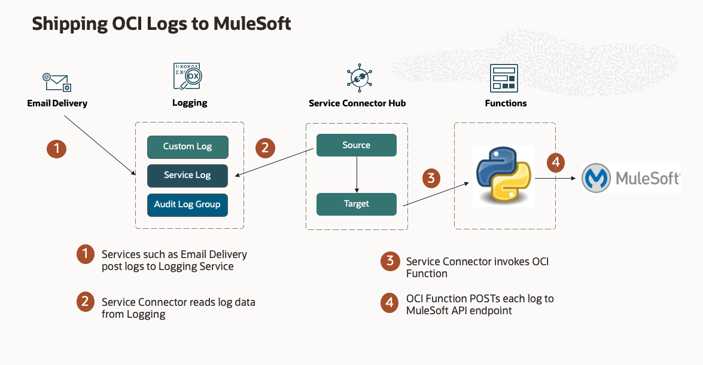

# OCI MuleSoft Observability

---

## Overview

The solution supports shipping both Logging Service and Monitoring Service observability
data sources to MuleSoft.  

### Shipping Email Delivery Logs 

Consider the specific use case of the
[OCI Email Delivery Service](https://docs.oracle.com/en-us/iaas/Content/Logging/Reference/details_for_emaildelivery.htm#details_for_emaildelivery).  It 
emits logs that track 'accepted' versus 'relayed' results for each attempted email delivery.  A Service Connector
bridges between those log sources and a serverless function that we use to POST the payloads to MuleSoft.
Note that the JSON formatted payloads are sent as-is (no message transformation takes place).

Please see these references for more details.

- [OCI Logging Overview](https://docs.oracle.com/en-us/iaas/Content/Logging/Concepts/loggingoverview.htm)
- [OCI Service Connector Hub](https://docs.oracle.com/en-us/iaas/Content/service-connector-hub/overview.htm)
- [OCI Functions Overview](https://docs.oracle.com/en-us/iaas/Content/Functions/Concepts/functionsoverview.htm)

### Function Environment

The Function requires a small amount of configuration.  Here are the supported variables:

| Environment Variable |    Default     | Purpose                                                                           |
|----------------------|:--------------:|:----------------------------------------------------------------------------------|
| API_ENDPOINT         | not-configured | REST API endpoint for reaching MuleSoft                                           |
| API_KEY              | not-configured | API license token obtained from MuleSoft                                          |
| API_KEY_HEADER       | not-configured | HTTP Header for passing API_KEY to MuleSoft                                       |
| ACCOUNT_ID           | not-configured | Account ID obtained from MuleSoft                                                 |
| ACCOUNT_ID_HEADER    | not-configured | HTTP Header for passing Account ID to MuleSoft                                    |
| FORWARD_TO_ENDPOINT  |      True      | Determines whether messages are forwarded to the configured MuleSoft API Endpoint |
| LOGGING_LEVEL        |      INFO      | Controls function logging outputs.  Choices: INFO, WARN, CRITICAL, ERROR, DEBUG   |
| BATCH_SIZE           |      1000      | Number of records per batch POST to MuleSoft.                                     |

## Workshops

Visit [LiveLabs](http://bit.ly/golivelabs) now to get started.  Workshops are added weekly, please visit frequently for new content.

- [The Essentials of Cloud Observability Workshop](https://apexapps.oracle.com/pls/apex/dbpm/r/livelabs/view-workshop?wid=708)

## License
Copyright (c) 2014, 2023 Oracle and/or its affiliates
The Universal Permissive License (UPL), Version 1.0
